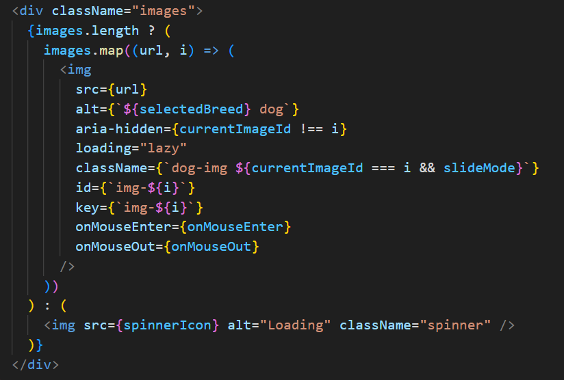

# Image carousel

For this project I used the [Dog API](https://dog.ceo/dog-api/documentation/)

## How works?

After React.js first render, it execute the first useEffect from AppContext.js file. In this function the API is fetched and the images are obtained. This useEffect depends on selectBreed state, in case that the client choose another dog breed.

The second useEffect set a timer only if there is an array of images and the mouse is not over on one of these images (meaning that the carousel is paused), so the timer will be created after we get the images.

Meanwhile the carousel will show the first image, because I set by default values the first element of the array and the slide mode to forward.

Images component:

Styles according to slide mode:

When the timer expires 3 seconds, it will call the slideForward function.

The slideForward function updates currentImageId with the next image to be displayed, so the image with index 1 will slide forward.

If a click event happens on some button (backward, forward or select image button) the function responsible to handdle the event will update currentImageId and slideMode, then the selected image will be displayed and slide according to slideMode.

Meanwhile, the second useEffect depends on the currentImageId state so the actual timer will be cleared and a new one will be created.

## License

[MIT](https://choosealicense.com/licenses/mit/)
