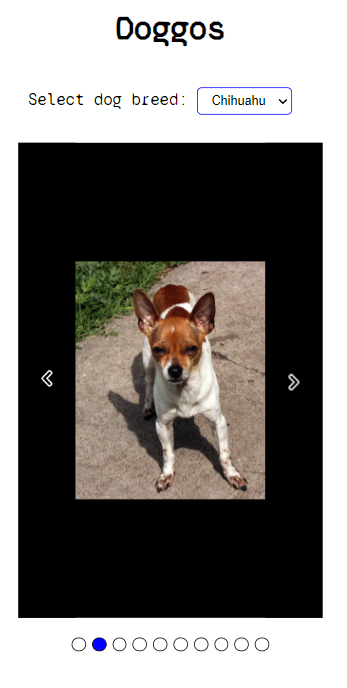
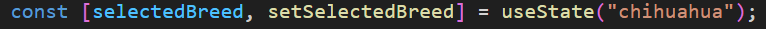
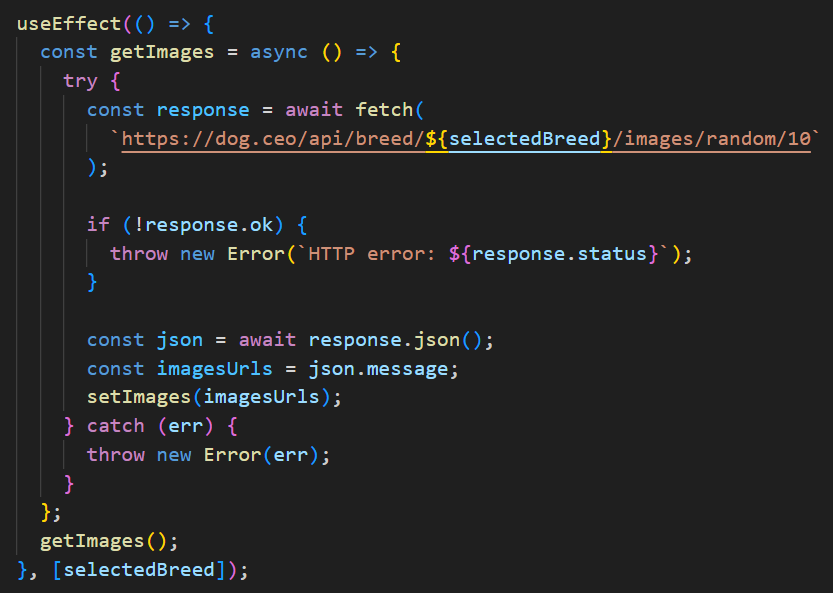
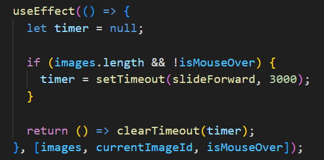
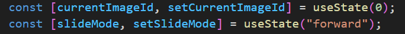
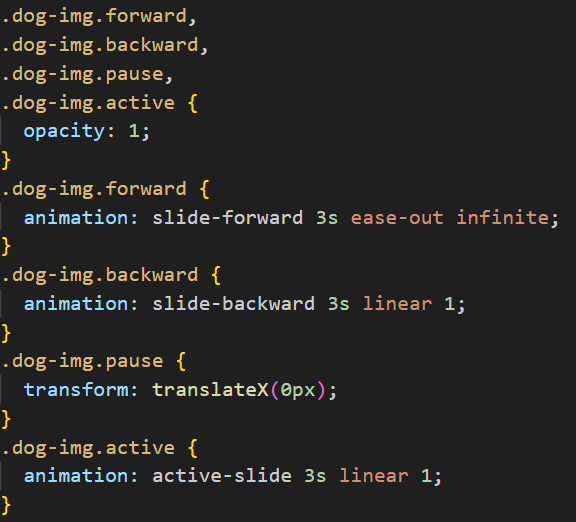
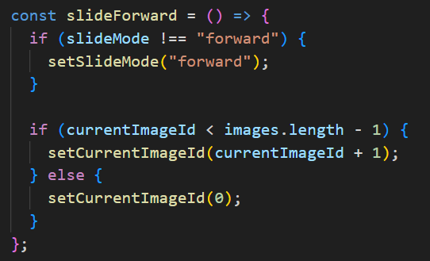

# Image carousel

This project utilizes the [Dog API](https://dog.ceo/dog-api/documentation/) to create a dynamic and interactive image carousel showcasing dog breeds.

## How it works?

1.  Upon the initial render of the React.js application, the first useEffect in the AppContext.js file is triggered. This useEffect fetches images from the Dog API based on the selected breed (defaulting to the initial value).

2. A timer is set by the second useEffect only if there is an array of images available, and the mouse is not hovering over any image (indicating the carousel is not paused).

3. Initially, the carousel displays the first image as default.

4. The styles dynamically adjust based on the selected slide mode (forward, backward, or fade).

5. When the timer expires after 3 seconds, the slideForward function is called.

6. The slideForward function updates the currentImageId to display the next image in the carousel.

7. Click events on navigation buttons (backward, forward, or select image) trigger functions that update currentImageId and slideMode. The selected image is displayed and slides according to the specified mode.

8. Simultaneously, the second useEffect listens for changes in the currentImageId state. It clears the existing timer and creates a new one to manage the automatic sliding behavior.

Feel free to explore the code and provide feedback or suggestions. Happy coding!
